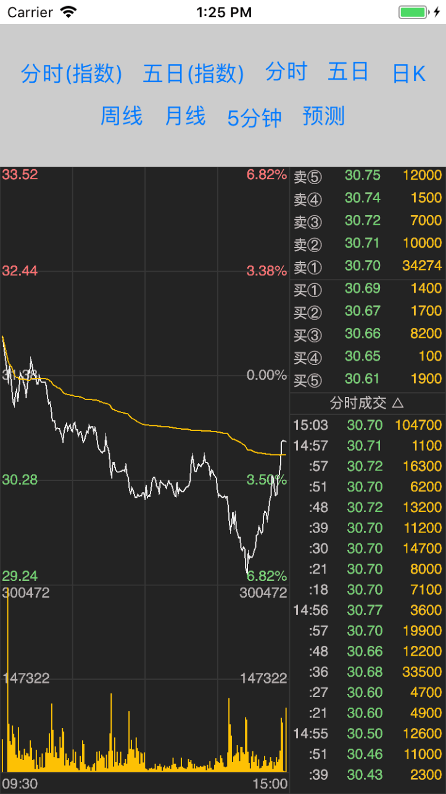
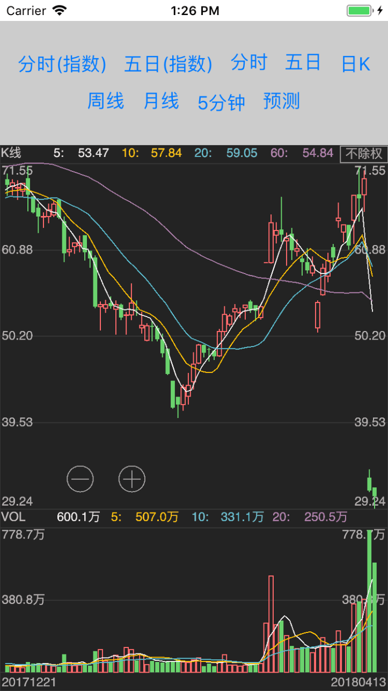
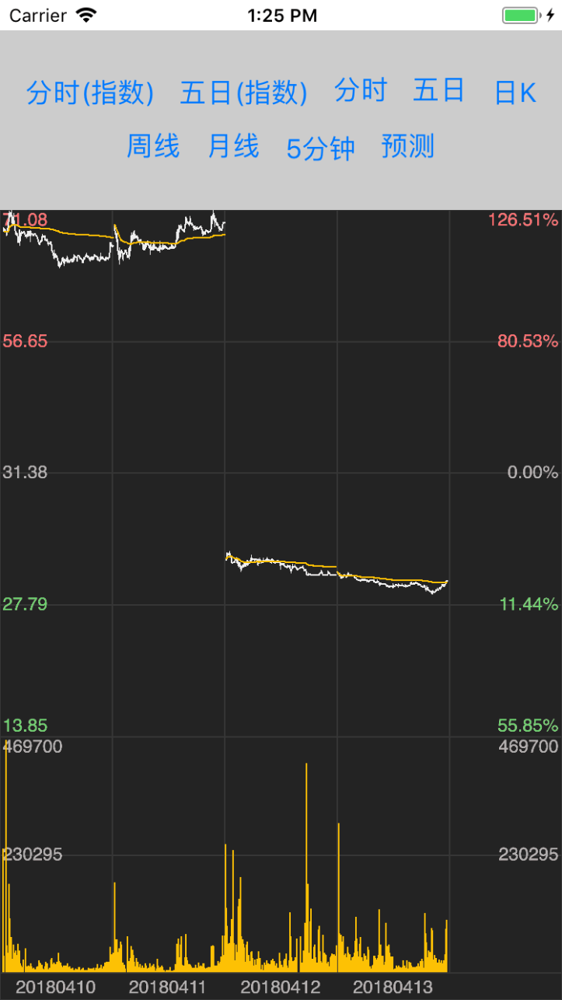

# React Native demo for clchart

> Clchart uses [GCanvas](https://github.com/alibaba/GCanvas) for cross-platform drawing.

## Running

### Clone & install

* Clone this repo `git clone https://github.com/seerline/clchart.git`
* `cd samples/RNClChartDemo`
* run `yarn` or `npm install`

### iOS

* Run `react-native run-ios`

### Android(Todo)

> [GCanvas](https://github.com/alibaba/GCanvas) is difficulties integrating on React Native android platform, so android not support right now.

* Run `android avd` and start an emulator
* Run `react-native run-android`

## Screenshot

## License

Released under the [MIT License](http://opensource.org/licenses/MIT).